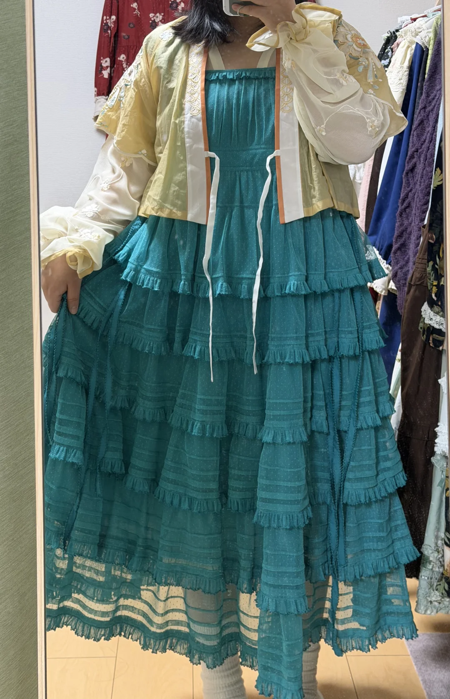
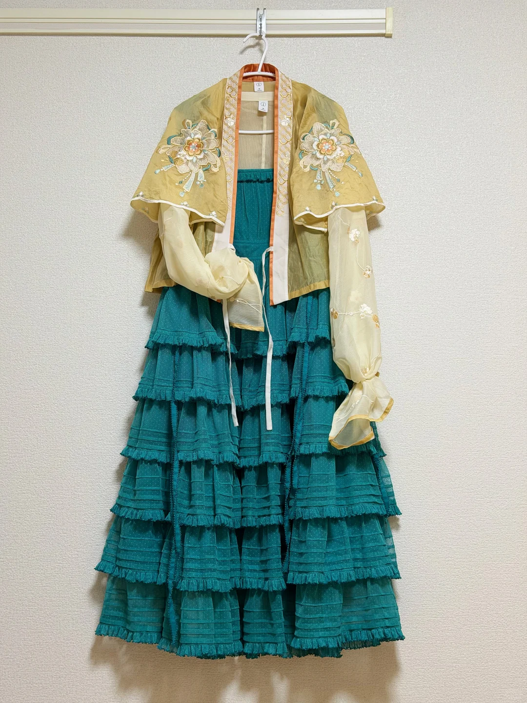
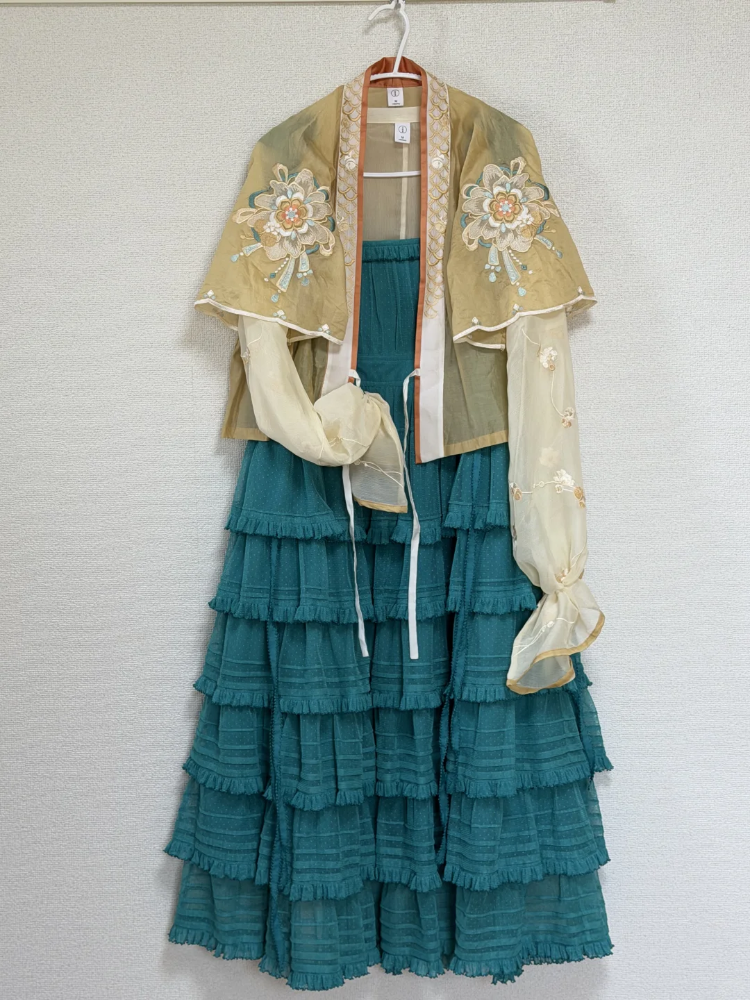

# 小女子已经被青色落日珊瑚的搭配逼疯

### 基本信息
👤 作者：-喜-樂-
📅 发布时间：2026-03-23
🌍 发布地点：日本
❤️ 点赞数：35
⭐ 收藏数：3
💬 评论数：12
🔗 原文链接：https://www.xiaohongshu.com/discovery/item/69c0cef7000000001b001245
🏷️ 标签：#Lolita日常 #Lolita #吃我一波lolita安利 #落日珊瑚

---

### 正文内容
太难搭了 公寓里没几件汉服了，都扔在家里，只能摸出了青玉金铃 感觉青色和金色是最配的，拿汉服搭落日珊瑚的思路非常对，不过以前的衣服尺码小了现在穿起来好显胖 等我物色物色新的飞机袖和唐半臂看看！

---

### 图片展示

---

### 精选评论
1. @梦中情猫是奶牛猫呀：你拿到的好快！青色真的很好看
2. @-喜-樂-（作者）：跑路太快，腰带项链都没拿
3. @-佐藤小草莓-：这太好看了！！！
4. @momo：可以用迷宫花园的黄开衫试看看
5. @卖专家的小报纸（请礼貌回复）：这个黄色如果是更亮的那种金黄金黄的，和青色的明度差不多的话，感觉就更好
6. @限定小糖果：感觉你需要小春日和的黄色开衫
7. @是子卢啊：好漂亮
8. @卖专家的小报纸（请礼貌回复）：甜菜！

---

### 我的笔记
